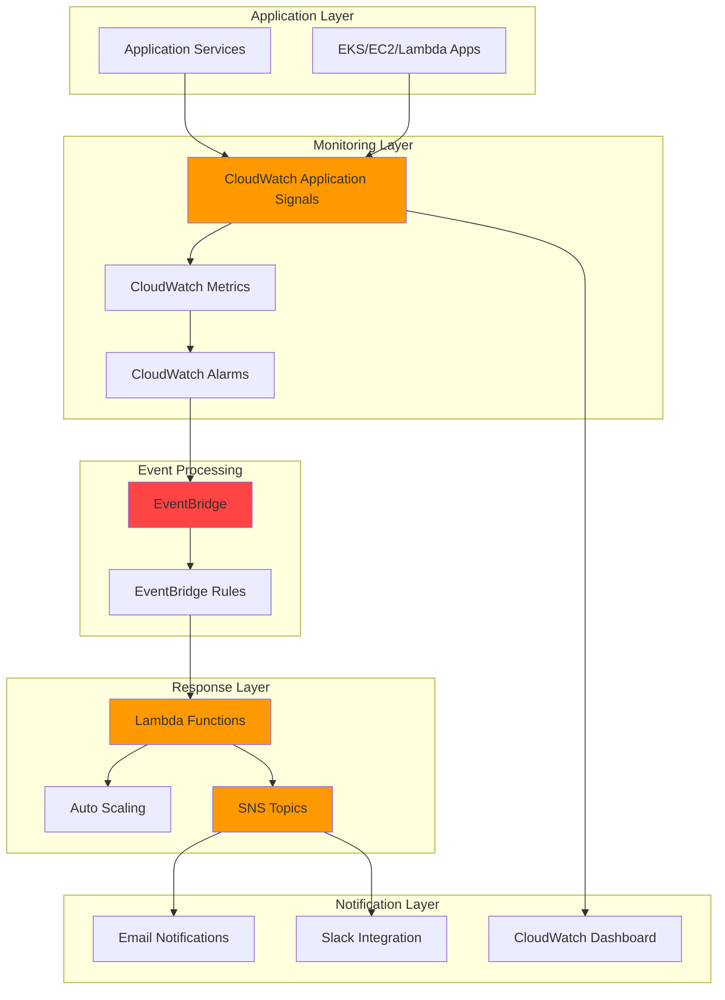

# Application-Performance-Monitoring-Automation

## Architecture Diagram

## Prerequisites

1. AWS account with appropriate permissions for CloudWatch, EventBridge, Lambda, SNS, and IAM services
2. AWS CLI v2 installed and configured (minimum version 2.0) or AWS CloudShell access
3. Basic knowledge of AWS monitoring services and event-driven architectures
4. An existing application running on AWS (EKS, EC2, or Lambda functions)
5. Estimated cost: $20-50/month for moderate monitoring workload (varies based on metrics volume and notification frequency)
