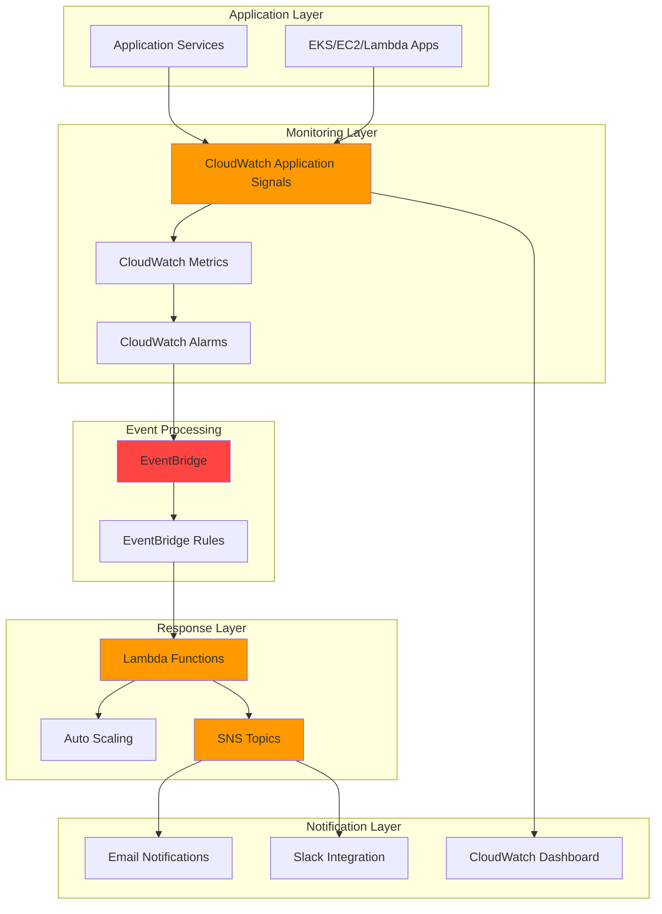

#  Infrastructure as Code for Application Performance Monitoring Automation


## Architecture Diagram



## Prerequisites

1. AWS account with appropriate permissions for CloudWatch, EventBridge, Lambda, SNS, and IAM services
2. AWS CLI v2 installed and configured (minimum version 2.0) or AWS CloudShell access
3. Basic knowledge of AWS monitoring services and event-driven architectures
4. An existing application running on AWS (EKS, EC2, or Lambda functions)
5. Estimated cost: $20-50/month for moderate monitoring workload (varies based on metrics volume and notification frequency)

## Preparation

```bash
cd terraform/

# Initialize Terraform
terraform init

# Create terraform.tfvars file
cat > terraform.tfvars << EOF
aws_region = "us-west-2"
notification_email = "your-email@example.com"
application_name = "MyApplication"
environment = "production"
EOF

# Review planned changes
terraform plan

# Deploy infrastructure
terraform apply

# View outputs
terraform output
```
### Terraform Variables

Key variables in `terraform.tfvars`:

```hcl
aws_region          = "us-west-2"
notification_email  = "your-email@example.com"
application_name    = "MyApplication"
environment         = "production"
latency_threshold   = 2000
error_rate_threshold = 5
throughput_threshold = 10

# Optional tags
tags = {
  Environment = "production"
  Owner       = "platform-team"
  Project     = "monitoring"
}
```
## Architecture Components

This IaC deployment creates the following AWS resources:

- **CloudWatch Application Signals**: Automatic application instrumentation and metrics collection
- **CloudWatch Alarms**: Monitor latency, error rates, and throughput thresholds
- **EventBridge Rules**: Route CloudWatch alarm state changes to processing functions
- **Lambda Function**: Intelligent event processing and automated remediation
- **SNS Topic**: Multi-channel notification delivery
- **CloudWatch Dashboard**: Real-time performance monitoring visualization
- **IAM Roles and Policies**: Secure permissions following least privilege principle

## Post-Deployment Configuration

### 1. Confirm Email Subscription

After deployment, you'll receive an email subscription confirmation. Click the confirmation link to receive alerts.

### 2. Verify Application Signals

```bash
# Check if Application Signals is collecting metrics
aws cloudwatch list-metrics \
    --namespace AWS/ApplicationSignals \
    --query 'Metrics[?MetricName==`Latency`]'
```

### 3. Access the Dashboard

Navigate to the CloudWatch console and find your dashboard named `ApplicationPerformanceMonitoring-{suffix}` to view real-time metrics.

### 4. Test Alarm Functionality

```bash
# Get the alarm name from outputs
ALARM_NAME=$(aws cloudformation describe-stacks \
    --stack-name app-performance-monitoring \
    --query 'Stacks[0].Outputs[?OutputKey==`HighLatencyAlarmName`].OutputValue' \
    --output text)

# Test alarm by setting it to ALARM state
aws cloudwatch set-alarm-state \
    --alarm-name $ALARM_NAME \
    --state-value ALARM \
    --state-reason "Manual test of monitoring system"
```

## Monitoring and Maintenance

### Health Checks

```bash
# Check EventBridge rule status
aws events describe-rule --name performance-anomaly-rule-*

# Check Lambda function health
aws lambda get-function --function-name performance-processor-*

# View recent Lambda invocations
aws logs describe-log-groups --log-group-name-prefix /aws/lambda/performance-processor
```

### Updating Thresholds

To modify alarm thresholds after deployment, update the parameters and redeploy:

```bash
# CloudFormation
aws cloudformation update-stack \
    --stack-name app-performance-monitoring \
    --template-body file://cloudformation.yaml \
    --parameters ParameterKey=LatencyThreshold,ParameterValue=3000 \
    --capabilities CAPABILITY_IAM

# Terraform
terraform apply -var="latency_threshold=3000"
```

## Troubleshooting

### Common Issues

1. **Application Signals not showing data**:
   - Ensure your application is properly instrumented
   - Verify the application is running and receiving traffic
   - Check that Application Signals is enabled in your AWS region

2. **Lambda function not processing events**:
   - Check EventBridge rule is enabled and properly configured
   - Verify Lambda function has correct IAM permissions
   - Review Lambda function logs in CloudWatch Logs

3. **Notifications not received**:
   - Confirm email subscription in SNS
   - Check SNS topic has correct permissions
   - Verify alarm actions are properly configured

### Debug Commands

```bash
# Check Lambda function logs
aws logs tail /aws/lambda/performance-processor-* --follow

# Verify EventBridge rule targets
aws events list-targets-by-rule --rule performance-anomaly-rule-*

# Check alarm history
aws cloudwatch describe-alarm-history --alarm-name AppSignals-HighLatency-*
```

## Cleanup
```bash
cd terraform/
terraform destroy
```

   ```

